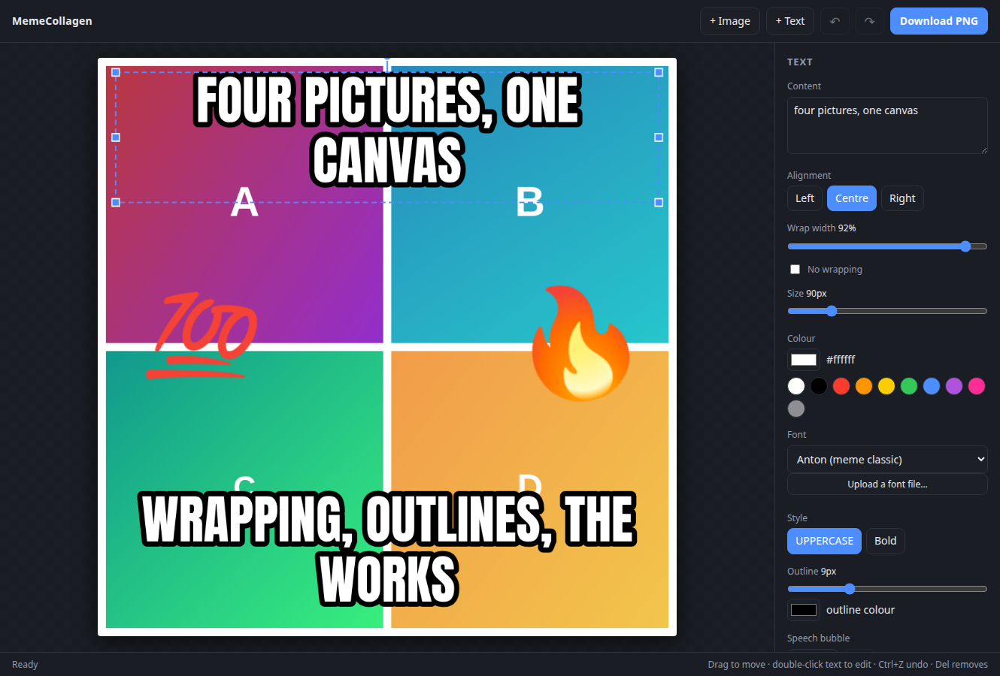
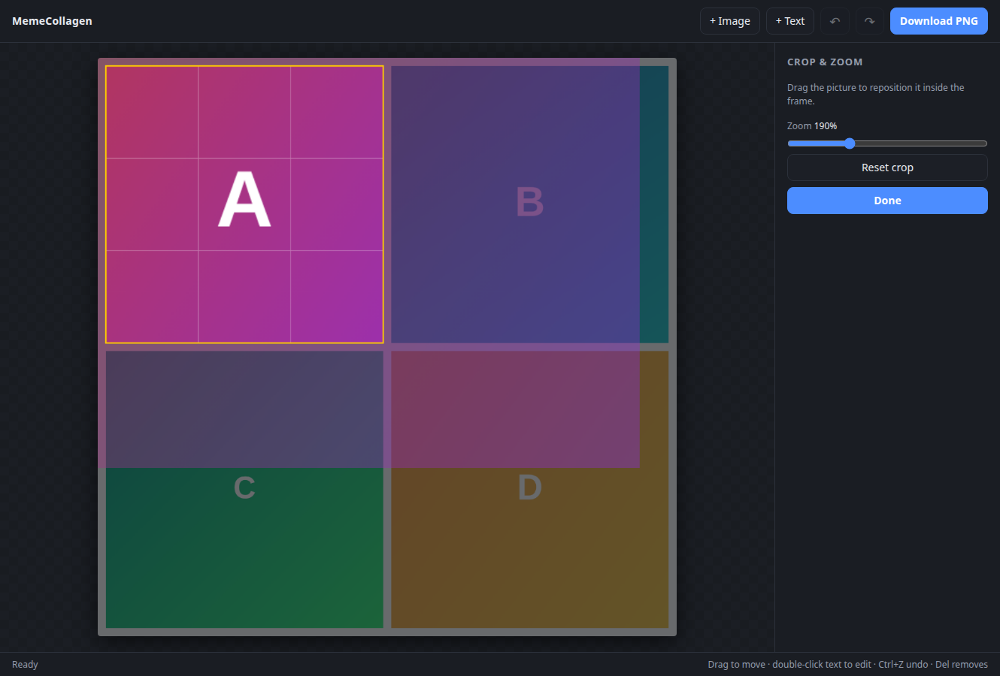
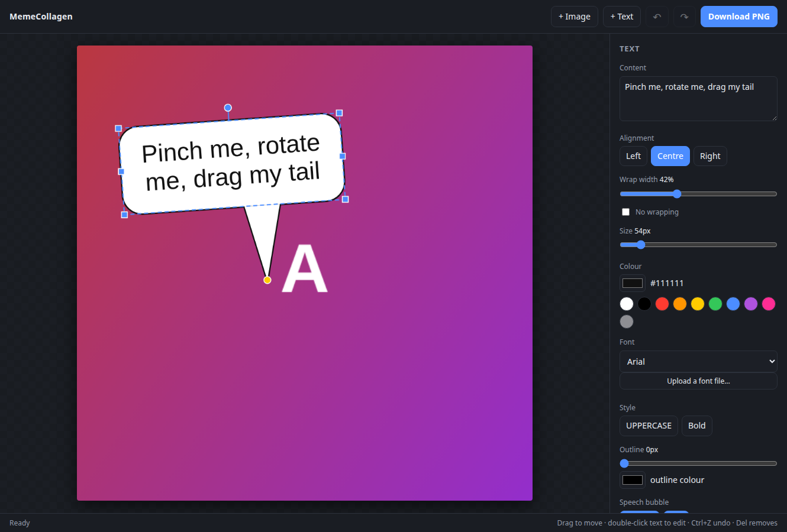

<h1 align="center">MemeCollagen</h1>

<p align="center">
  <b>Collage + generator.</b> The connective tissue between your pictures and your punchline.
</p>

<p align="center">
  <a href="https://github.com/SciScend/meme-collagen/actions/workflows/tests.yml"></a>
  <a href="LICENSE"></a>
  
  
</p>

<p align="center">
  
</p>

Drop in pictures, arrange them into a collage, caption them, export a PNG.

No dependencies, no build step, no server, no account, no upload. Open the HTML file and it
works — and it keeps working on a plane, because your images never leave the tab they were
dropped into.

## Quick start

```bash
git clone https://github.com/SciScend/meme-collagen.git
cd meme-collagen
xdg-open index.html      # or: open index.html   /   or just double-click it
```

That is the whole install. If your browser is strict about `file://` URLs, serve the folder
instead:

```bash
python3 -m http.server 8000
# then open http://localhost:8000
```

## Features

### Pictures

- Add them with **+ Image**, by dropping files onto the canvas, or by pasting from the clipboard.
- Drag to move, drag a corner to resize, drag the handle above to rotate (hold <kbd>Shift</kbd>
  to snap to 15°). Scroll to resize. Rotate by 90° and flip from the side panel.
- **Crop & zoom** — double-click a picture and the rest of the canvas dims, the parts you are
  cutting away show through as a ghost, and you drag the picture around inside its frame.
- An optional photo border, in any colour.

<p align="center">
  
</p>

### Collage layouts

Grid, Rows, Columns, Big + side, and Filmstrip, with an adjustable gap.

Frames are always filled edge to edge: the crop follows the frame's shape, so pictures are
never letterboxed and never squashed.

### Text

- **+ Text** drops a caption; double-click any caption to edit it.
- Size, colour (picker or swatches), font, UPPERCASE, bold, and an outline whose width and
  colour you control — that outline is what keeps white text readable over a busy photo.
- **Alignment** and **wrap width**: text reflows inside its box, and a word too long to fit is
  broken rather than allowed to run off the canvas. Wrapping can be switched off entirely.
- **Speech bubbles** — turn any caption into a bubble, set its fill and outline, and drag the
  yellow handle to point the tail wherever you like.
- **Stickers** — 30 emoji, added as ordinary layers you can move, scale and rotate.

<p align="center">
  
</p>

### Templates

Top & bottom captions, caption bar, demotivational poster, speech bubble.

Template captions are *pinned* to the canvas edge: type a longer caption and the block grows
inwards instead of sliding off. Dragging it releases the pin.

### Fonts

- **Anton** (the classic meme look) and **Oswald** (which also covers Cyrillic) ship embedded
  as base64 in `fonts.css`, so a meme looks the same offline and on any machine — no hoping
  that Impact happens to be installed. Both are OFL 1.1; see [FONT-LICENSE.txt](FONT-LICENSE.txt).
- **Upload your own** `.ttf` / `.otf` / `.woff` / `.woff2`. It is stored with the project, so it
  survives a reload.

### Undo, autosave, export

- Full undo/redo, 80 steps deep.
- Your work saves itself — IndexedDB where available, otherwise local storage. The status line
  says so plainly if the browser blocks storage entirely.
- **Download PNG** at 1×, 2× or 3× the canvas size, with none of the editing outlines baked in.

## Keyboard & touch

| Input | Does |
| --- | --- |
| <kbd>Ctrl</kbd>+<kbd>Z</kbd> / <kbd>Ctrl</kbd>+<kbd>Shift</kbd>+<kbd>Z</kbd> | undo / redo |
| <kbd>Ctrl</kbd>+<kbd>D</kbd> | duplicate the selection |
| <kbd>Delete</kbd> | remove the selection |
| arrow keys (<kbd>Shift</kbd> for bigger steps) | nudge |
| <kbd>[</kbd> / <kbd>]</kbd> | send backward / bring forward |
| <kbd>Esc</kbd> | leave crop mode, or deselect |
| double-click | edit a caption, or crop a picture |
| scroll | resize the selection, or zoom the crop |
| one finger | drag, resize, rotate |
| two fingers | pinch to scale, twist to rotate, move together to pan |

## Tests

```bash
./tests/run.sh          # drives the real app in headless Chrome over http://
./tests/run.sh file     # the same suite over file://
```

85 checks covering importing, layouts, cropping, wrapping, rotation, dragging, pinch gestures,
undo/redo, bubbles, templates, custom fonts, autosave round-trips and the PNG export —
including pixel assertions on the exported image.

The runner builds a throwaway copy of the real `index.html` with `tests/tests.js` appended, so
the tests can never drift from the app they are testing. Both modes run on every push and pull
request.

## How it is built

Eight source files, plain `<script>` tags, no modules — which is precisely what lets it run
from a `file://` URL, where ES module imports are blocked by CORS.

| Path | Purpose |
| --- | --- |
| `index.html` | Markup: toolbar, canvas stage, side panel |
| `styles.css` | All styling |
| `fonts.css` | Bundled Anton + Oswald, embedded as base64 |
| `store.js` | Image and font assets, autosave, undo history |
| `model.js` | Document state, geometry, text layout, collage layouts, templates |
| `render.js` | Canvas drawing: layers, crop overlay, selection handles, export |
| `interact.js` | Pointer, touch and keyboard editing |
| `ui.js` | Side panel, importing, exporting, boot |
| `tests/` | Headless browser test suite |
| `docs/` | Screenshots and the script that regenerates them |

Three decisions carry most of the design:

- **A layer holds an asset id, never an ``.** That makes the whole document plain JSON,
  which in turn makes undo and autosave nearly free — a snapshot is one `JSON.stringify`.
- **Everything is centre-anchored and may be rotated.** Hit testing transforms the pointer into
  each layer's own space rather than tracking rotated corners around the canvas.
- **Imported images are capped at 1600px on the long edge,** so autosave stays inside the
  browser's storage quota.

## Browser support

Any current Chrome, Firefox, Safari or Edge, on desktop or touch. It leans on Pointer Events,
the `FontFace` API and canvas 2D. IndexedDB is used when available and degrades to local
storage, then to memory-only, without breaking the editor.

## Not included

Layer list and renaming, freehand drawing, per-layer opacity and blend modes, image filters,
multi-select, and animated output (GIF or video). Several of those are good ideas — see
[CONTRIBUTING.md](CONTRIBUTING.md) if you would like to build one.

## Contributing

Bug reports and pull requests are welcome. Start with [CONTRIBUTING.md](CONTRIBUTING.md); by
taking part you agree to the [Code of Conduct](CODE_OF_CONDUCT.md). Notable changes are listed
in the [changelog](CHANGELOG.md).

## Licence

[MIT](LICENSE) © 2026 SciScend. The bundled typefaces are OFL 1.1 — see
[FONT-LICENSE.txt](FONT-LICENSE.txt).

---

Built by [Iva Popova](https://sciscend.com) — SciScend.
